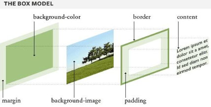
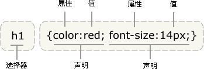

# 该文档存放已经置于anki的知识点

## 图示解释盒子模型（The Box Model）
涉及到的几个关键术语为：
margin
background-color
background-image
border
padding
content

图片示意如下（图片来自网络）


## Css的中英文全称是什么？
Cascading Style Sheets
层叠样式表

## Html 的中英文全称是什么？
HyperText Marked Language
超文本标记语言


## html文件的基本结构包含哪些内容？

包含 DOCTYPE, html, head, body 标签对等，内容如下：
```
<!DOCTYPE html>
<html lang="zh">
    <head>
        <meta charset="UTF-8">
        <title>1zhi</title>
        <link href="/style.css",type="text/css",rel="stylesheet"/>
    </head>

    <body>

    </body>

</html>
```

## 在html中引入css外部样式表的语法格式？

```
<link href="/sytle.css", type="text/css", rel="stylesheet"/>
```

## 在html中有哪三种引入css样式表的方法，如果多种引入样式表的方式同时使用时会有什么效果？

* 方法一外部样式表：通过在head中引入link的方式
```
<link href="/style.css", type="text/css", rel="stylesheet" />
```
* 方法二内部样式表：在head中定义内部样式表
```
<style type="text/css">
    hr {color: sienna;}
</style>
```
* 方法三内联样式：在相关的html标签内使用
```
<p style="color: sienna; margin-left: 20px">
This is a paragraph
</p>
```

如果多种引入样式表的方法同时使用，如果某些属性在不同的样式表中被同样的选择器定义，属性值将从更具体的样式表中被继承。

## html 和 css的注释语法是？
```
<! --html 的注释内容-->
```

```
/* css的注释内容 */
```

## css 中的基本概念有哪些，并用实际的代码举例说明？

规则、选择器、声明（包含属性和值）

**CSS 规则**由两个主要的部分构成：选择器，以及一条或多条声明。

**选择器**通常是您需要改变样式的 HTML 元素。

每条**声明**由一个属性和一个值组成。

属性（property）是您希望设置的样式属性（style attribute），每个属性有一个值。属性和值被冒号分开。

```
selector {property: value}
```

以下代码举例
```
h1 {color:red; font-size:14px;}
```



## css 中的伪元素是什么，常用的伪元素有哪些？

英文为：Pseudo-elements

CSS 伪元素用于向某些选择器设置特殊效果。

常用的伪元素有：
:first-line
:first-letter
:before
:after


## 说明

卡片的内容大部分来自自己的理解，图片一般来自互联网的搜索，一些概念和定义来自[w3school](https://www.w3school.com.cn/css/css_syntax.asp)，均为非商业引用。